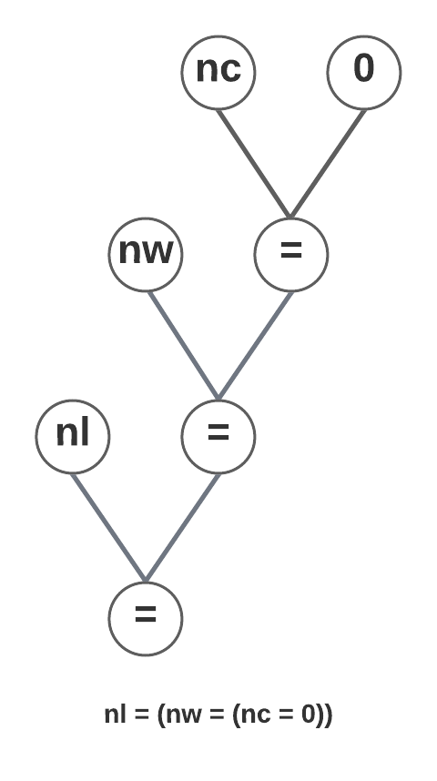

# Árboles de expresión
## 1B: Dibujar el árbol de expresión para la inicialización de los contadores: nl = nw = nc = 0.

## 1C: Dibujar el árbol de expresión para la expresión de control del segundo if: c == ' ' || c == '\n' || c == '\t'.

## 2A: Máquina de estado

## 2B: Formalización de la máquina de estado

M = (Q, Σ, q0, T, A) donde:

- Q = {IN, OUT}
- Σ = ASCII, partición P = {{espaciador}, {no espaciador}}.
- q0 = OUT
- T = {OUT => no espaciador => IN, OUT => espaciador => OUT, IN => espaciador => (arrayLengths[ncw > MAX_WORD_LENGTH ? MAX_WORD_LENGTH : ncw-1]++ ,  ncw=0) => OUT, IN => no espaciador => ncw++ => IN}
- A = {{++ncw}; {arrayLengths[ncw > MAX_WORD_LENGTH ? MAX_WORD_LENGTH : ncw-1]++ ,  ncw=0}}

# Respuestas

## 3A ii: Indicar ventajas y desventajas de la versión de [KR1988] y de esta implementación.
El hecho de utilizar switch permite una mayor organización a la hora de implementar la máquina de estado. Ya que cada estado puede ser representado por un "case". Esto lo hace más mantenible, ya que su estructura está bien delimitada.
Por otro lado, la principal desventaja de esta implementación es que no siempre es la más óptima, ya que hay estados y transiciones que pueden ser redundantes y aún así son explicitadas. Además, si se trabaja con una máquina con muchos estados, el código se torna desorganizado y difícil de leer.

## 3B: ¿Tiene alguna aplicación go to hoy en día? ¿Algún lenguaje moderno lo utiliza?
No, hoy en día no tiene ninguna aplicación usar goto, ya que este salto de instrucción no respeta ningún contexto, ni encapsulamiento ni protecciones de seguridad. Además, el código que usa goto es muy difícil de leer y de mantener. Estas sentencias pueden ser simplemente reemplazadas por ciclos y otros condicionales. Por lo tanto, no se recomienda usar goto en ningún lenguaje moderno, ni aunque esté soportado.
Goto actualmente solo es utilizado en los scripts Batch de Windows, ya que estos no soportan ninguna sintaxis de control de flujo más moderna.
## 3C: ¿Es necesario que las funciones accedan a a contadores? Si es así, ¿cómo hacerlo?
No, no es necesario que las funciones accedan a los contadores, ya que estos pueden ser pasados como parámetros a las funciones, y así tampoco se requieren variables globales. El valor de retorno de la función es el mismo int que se pasó como parámetro, lo que le permite a la función que llamó actualizar el valor. El array con las cantidades de palabras es un parámetro que va por referencia, lo que permite que cada iteración lo modifique.
# Benchmark
