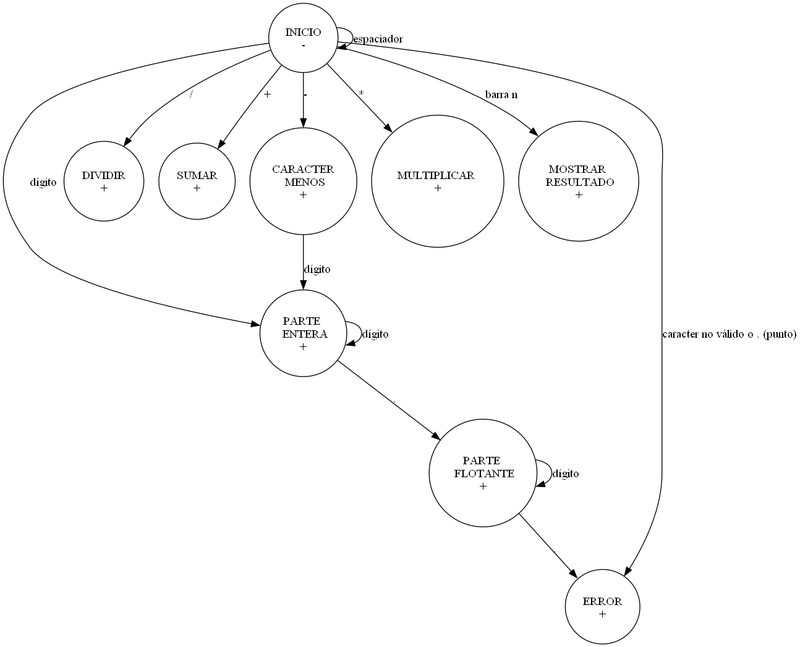

1. Diagramar en Dot las dependencias entre los componentes e interfaces.

2. Definir formalmente y con digrafo en Dot la máquina de estados que implementa GetNextToken, utilizar estados finales para diferentes para cada clase de tokens.

M = (Q, Σ, q0, qf, T) donde:

Q = {Inicio, Dividir, Sumar, Caracter Menos, Multiplicar, Resultado, Parte Entera, Restar, Parte Flotante, Error}

Σ = ASCII, partición P = {{caracter válido}, {caracter no válido}}.

  - Caracter válido = {1, 2, 3, 4, 5, 6, 7, 8, 9, 0, +, -, /, *, ' ', \t, \n, .}

  - Caracter no válido = ASCII - Caracter válido

  - Dígito = {1, 2, 3, 4, 5, 6, 7, 8, 9, 0}

  - Espaciador = {' ', \t, \n}

  - Operador = {+, -, /, *}

q0 = Inicio

qf = {Dividir, Sumar, Caracter Menos, Multiplicar, Resultado, Parte Entera, Parte Flotante, Error}

T = {Inicio => espaciador => Inicio, 

Inicio => / => Dividir, 

Inicio => + => Sumar, 

Inicio => - => Caracter menos,

Inicio => * => Multiplicar, 

Inicio => \n => Resultado, 

Inicio => Dígito => Parte Entera,

Caracter Menos => Dígito => Parte Entera,

Parte Entera => Dígito => Parte Entera,

Parte Entera => . => Parte Flotante,

Parte Flotante => Dígito => Parte Flotante,

Parte Flotante => . => Error,

Inicio => caracter no válido o . => Error}

3. Escribir un archivo expresiones.txt para probar la calculadora.

4. Construir el programa Calculator.

5. Ejecutar Calculator < expresiones.txt.

6. Responder:

| Calculadora polaca en C |

a. ¿Es necesario modificar StackModule.h? ¿Por qué?

No, debido a que la implementacion de StackModule.h existente en el libro del lenguaje C es suficiente para satisfacer las necesidades del programa.

b. ¿Es necesario recompilar la implementación de Stack? ¿Por qué?

Si, porque no es un modulo que esté incluido en el estandar C y se debe compilar para que el programa pueda usarlo.

c. ¿Es necesario que Calculator muestre el lexema que originó el error léxico? Justifique su decisión.

Si, ya que es necesario saber qué es lo que esta mal en la expresión, de esta forma el usuario podrá corregirla.

- i. Si decide hacerlo, ¿de qué forma debería exponerse el lexema?
  
Se puede mostrar el lexema en el mensaje de error.

Algunas opciones:

  - Tercer componente lexeme en Token ¿De qué tipo de dato es aplicable?

  - Cambiar el tipo de val para que sea un union que pueda representar el valor para Number y valor LexError.

- ii. Implemente la solución según su decisión.

## BNF de la notación polaca inversa

`<Dígito> ::= 1 | 2 | 3 | 4 | 5 | 6 | 7 | 8 | 9`

`<ConjuntoDeDígitos> ::= <Dígito> | <Dígito> <ConjuntoDeDígitos>`

`<AuxiliarPunto>::= .`

`<AuxiliarMenos>:: = -`

`<Número> ::= <ConjuntoDeDígitos> | <ConjuntoDeDígitos> <AuxiliarPunto> | <ConjuntoDeDígitos> <AuxiliarPunto> <ConjuntoDeDígitos> | <AuxiliarMenos> <Número>`

`<Operador> ::= + | - | * | / | '\n'`

`<Expresión> ::= <Número> | <Expresión> <Expresión> <Operador>`

<!--
Prueba del BNF con expresión compleja

10 2 3 + 7 - 2 9 + + + 

expresion
expresion expresion                                                                    operador          // ABRO 2DO EXPRSION
expresion expresion                                       expresion                    operador operador // ABRO 2DO EXPRSION
expresion expresion                    expresion operador expresion                    operador operador // ABRO 2DO EXPRESION
expresion expresion expresion operador expresion operador expresion                    operador operador // ABRO 5TO EXPRESION
expresion expresion expresion operador expresion operador expresion expresion operador operador operador // FIN
10            2         3         +       7        -          2         9         +       +         + 
 -->
