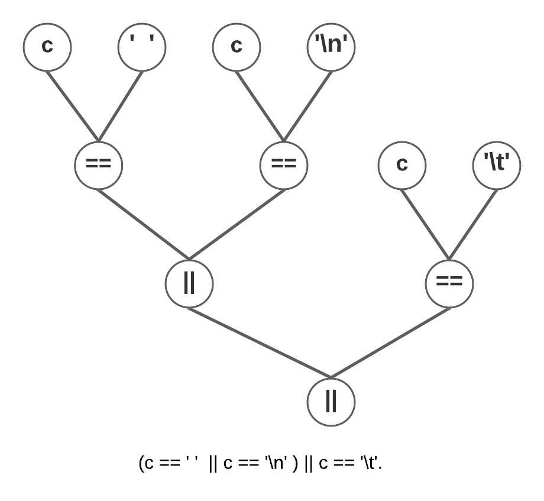
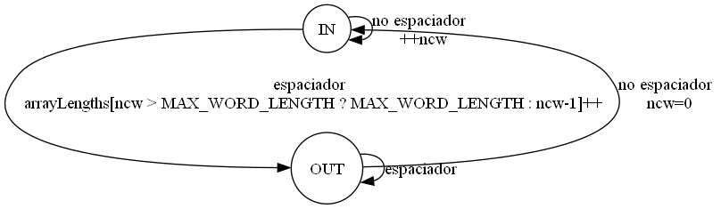

# SSL TPs Grupales
## Árboles de Expresión
**Árbol de expresión para la inicialización de los contadores: nl = nw = nc = 0**

**Árbol de expresión para la expresión de control del segundo if: c == ' ' || c == '\n' || c == '\t'.**

## Máquina de Estado
